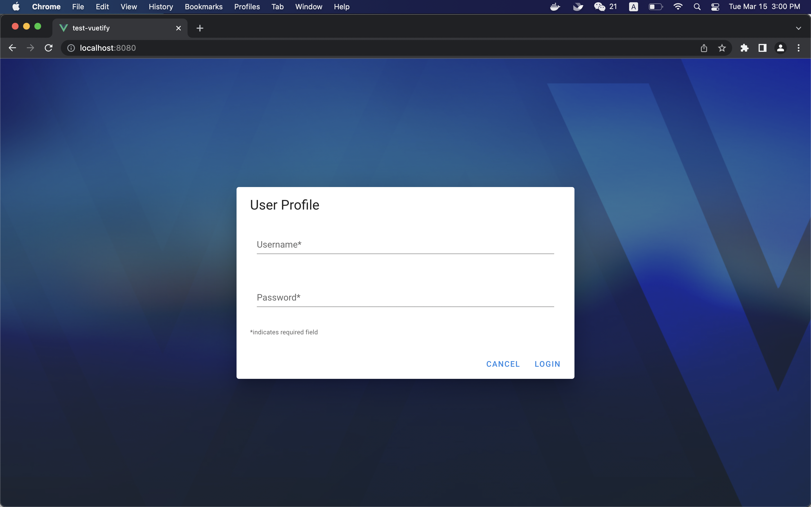
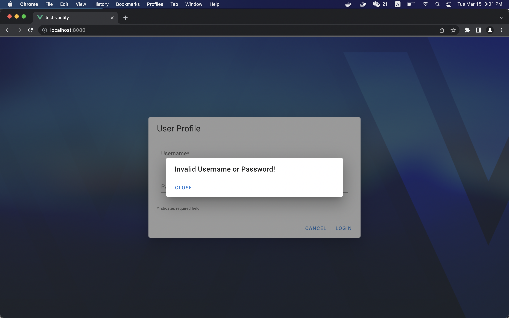
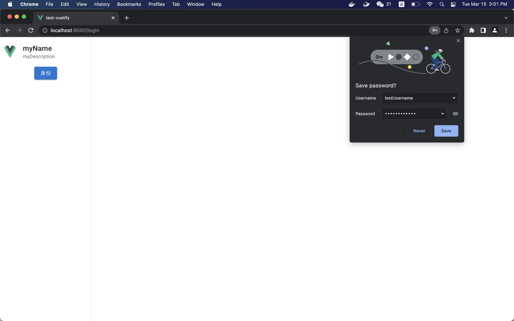
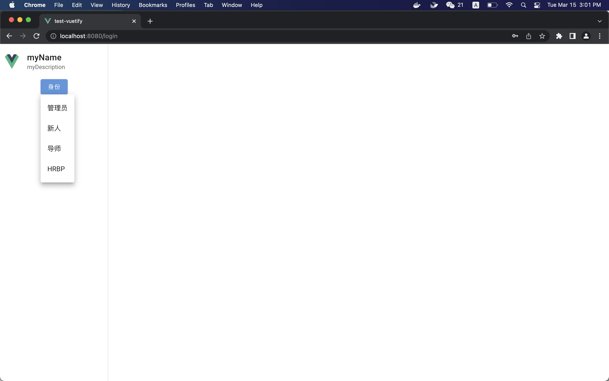
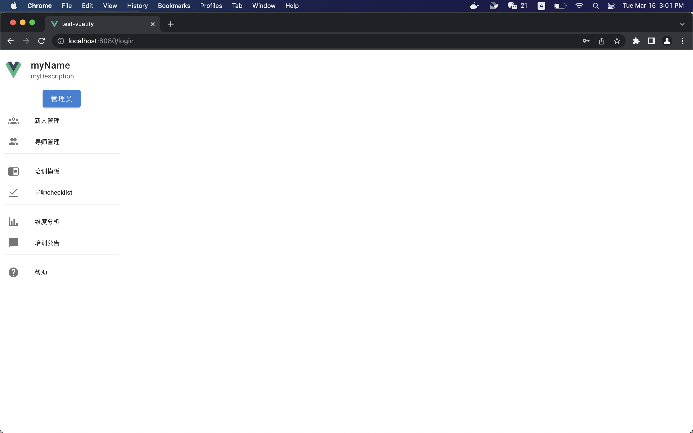
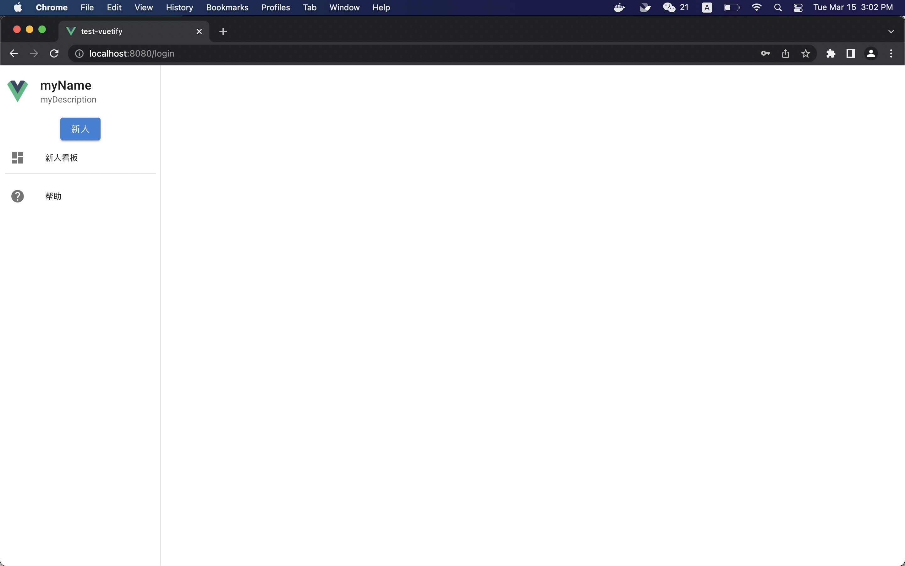
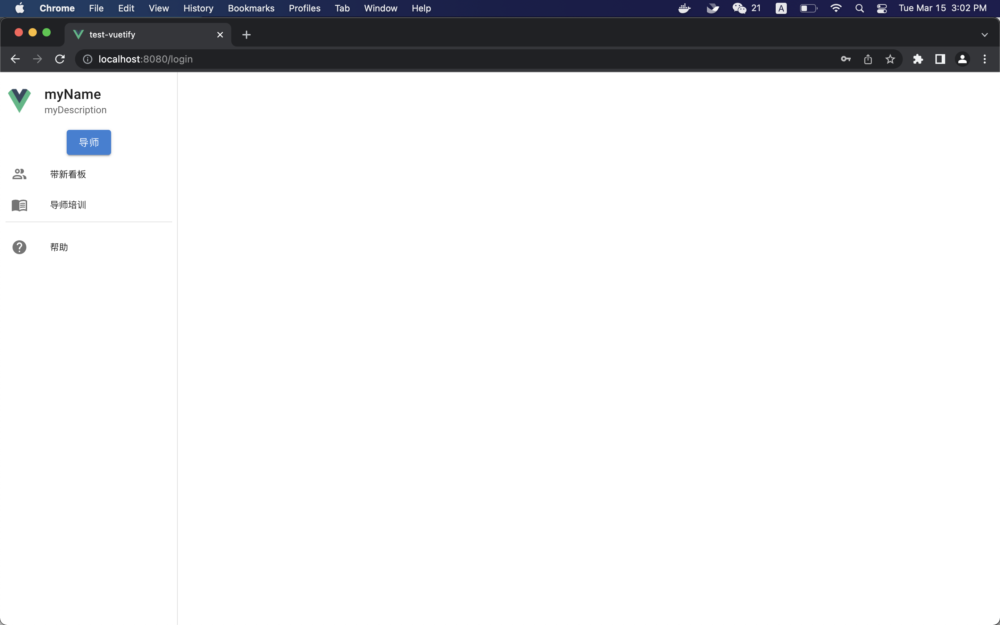
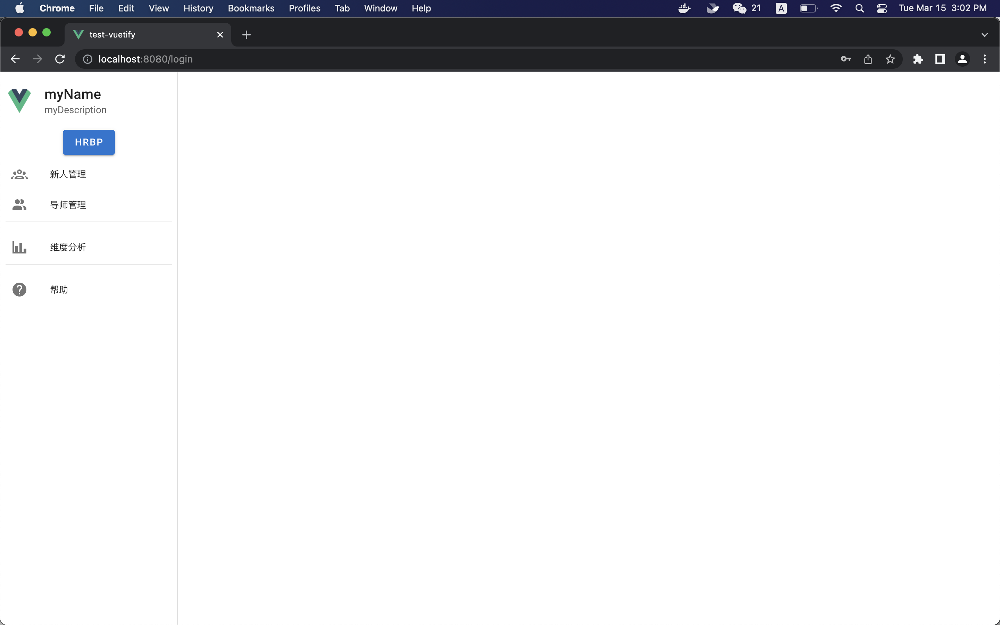
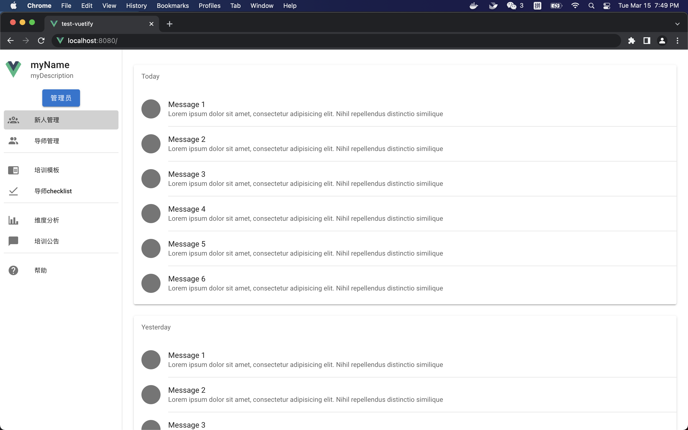

# frontend前端开发者文档

`Vue@2 + Vuetify`, 安装与运行见`README.md`
部分组件若Vuetify不支持需要的功能，可选取element或其他工具

## 学习参考文档

Vuetify: https://vuetifyjs.com/en/
Element: https://element.eleme.cn/#/zh-CN/

## 当前文件树

```
.
├── Dockerfile
├── README.md
├── babel.config.js
├── developerdocs.md（开发者文档）
├── jsconfig.json
├── package-lock.json
├── package.json
├── public
│   ├── favicon.ico
│   └── index.html
├── src（前端开发代码源文件夹）
│   ├── App.vue（App组件）
│   ├── assets
│   │   ├── logo.png
│   │   └── logo.svg
│   ├── components（组件）
│   │   ├── MainBoard.vue（右侧主界面）
│   │   ├── NavigationBar.vue（左侧导航栏）
│   │   ├── NewcomerManage.vue（新人管理）
│   │   └── WelcomePage.vue（欢迎页/登录页）
│   ├── main.js
│   ├── plugins
│   │   └── vuetify.js
│   └── router
│       └── index.js（路由配置）
└── vue.config.js 
```

## 各组件父子关系

```
── App
    ├── NavigationBar
    └── WelcomePage | MainBoard

── MainBoard
    ├── NewcomerManage
    ├── TutorManage
    ├── TrainTemplate 
    ├── TutorChecklist
    ├── DimensionAnalysis
    ├── TrainNotice
    ├── HelpPage
    ├── NewcomerBoard
    ├── LeadNewcomer
    └── TutorTrain
```

## 界面&功能

- [x] 基础页App
  - [x] 路由切换（App + router）
- [x] 欢迎主界面WelcomePage
  - [x] 用户登录
- [x] 导航栏NavigationBar
  - [x] 用户头像、姓名、介绍显示卡
  - [x] 身份选择下拉框
  - [x] 菜单显示区（实现不同身份显示不同的菜单项）
  - [x] 点击菜单选项，实现界面Interface切换
- [ ] 新人管理NewcomerManage
- [ ] 导师管理TutorManage
- [ ] 培训模板TrainTemplate
- [ ] 导师任务清单TutorChecklist
- [ ] 维度分析DimensionAnalysis
- [ ] 培训公告TrainNotice
- [ ] 帮助HelpPage
- [ ] 新人看板NewcomerBoard
- [ ] 带新看板LeadNewcomer
- [ ] 导师培训TutorTrain

## 数据接口

1. `WelcomePage.vue`
   
   1. `methods: login()`
      
      1. 前端数据：`usernameInput`, `passwordInput`（在前端由用户输入）
      
      2. 与后端通信协议：将前端数据：`usernameInput`, `passwordInput`通过`post` 请求，以`json`格式`{"user": usernameInput, "password": passwordInput}`（是否需要加密处理，待定）发送至后端`/api/login`（待定）；在后端数据库中查找用户名、密码是否匹配，相应返回`success`或`error`，在前端接收后端的返回值进行下一步页面渲染

2. `NavigationBar.vue`
   
   1. `methods: getUserInfo()`
      
      1. 前端数据：`userInfo`（从后端获取）
      
      2. 与后端通信协议：与前述协议联动，若后端返回`success`则后端需同时返回用户的个人信息（用户名、用户描述、用户头像）、权限信息（拥有管理员、新人、导师、HRBP中哪些权限），前端接收`json`格式，存储到`userInfo`字典中。
      
      ```javascript
      userInfo = {
        "userName": "myName",
        "userDescription": "myDescription",
        "userAvatarPath": require("../assets/logo.png"), // 需要加上require字段
        "userPositions": [
            "管理员", "新人", "导师", "HRBP"
        ]
      }
      ```
   
   2. `methods: getMenuList()`
      
      1. 前端数据：`menuList`
      
      2. 与前述协议联动，根据后端传来的`userInfo.userPositions`数据，在前端函数体中进行判断，决定前端渲染的工具栏中显示的组件，以及决定哪些组件的显示属性为`true`或`false`。

## 已完成界面

### 欢迎主界面WelcomePage


### 登录界面Login





### 导航栏NavigationBar-用户头像、姓名、介绍显示卡、身份选择下拉框、菜单显示区（实现不同身份显示不同的菜单项）、点击菜单项显示不同主界面














